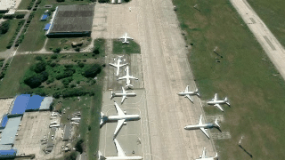
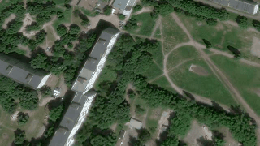

# FakeFlight Over Ukraine

FakeFlight Over Ukraine is a synthetic dataset for visual geo-localization.
It uses orthophotos downloaded from WMS providers to render camera frames along
predefined flight trajectories, together with metadata needed to reproduce each
run.

Actual code is vibecoded.

<table>
  <tr>
    <td></td>
    <td></td>
  </tr>
</table>

## Dataset structure

```text
dataset/
|-- location/
|   `-- <location>/
|       |-- cam-configs/       # Camera parameters
|       |-- motion-configs/    # Flight and camera motion parameters
|       |-- geoms/             # Area bounds and flight trajectories
|       `-- ortho/             # Source orthophotos
`-- renders/
    |-- renders.csv            # Registry of completed runs
    `-- <run-name>/
        |-- frames/            # Rendered camera images
        |-- meta.json          # Reproducible run metadata
        `-- render.mp4         # Optional preview video
```

## Regenerate an example

Run the following commands from the repository root.

1. Download WMS tiles for the location bounds:

   ```bash
   geo-gremlin download_wms_tiles "google" 19 \
     dataset/location/kharkiv-saltivka/geoms/bounds.geojson \
     dataset/location/kharkiv-saltivka/ortho
   ```

2. Merge the tiles into a georeferenced orthophoto:

   ```bash
   geo-gremlin merge-wms-tiles dataset/location/kharkiv-saltivka/ortho/google_19/
   ```

3. Render trajectory `0` and save a preview video:

   ```bash
   python scripts/render.py \
     dataset/location/kharkiv-saltivka/cam-configs/legacy-640x360.yaml \
     dataset/location/kharkiv-saltivka/motion-configs/nonoise-20fps.yaml \
     dataset/location/kharkiv-saltivka/geoms/traj.geojson \
     0 \
     dataset/location/kharkiv-saltivka/ortho/google_19.tif \
     --save_video=True
   ```

Generated frames, metadata, and the optional video are written to
`dataset/renders/`.
